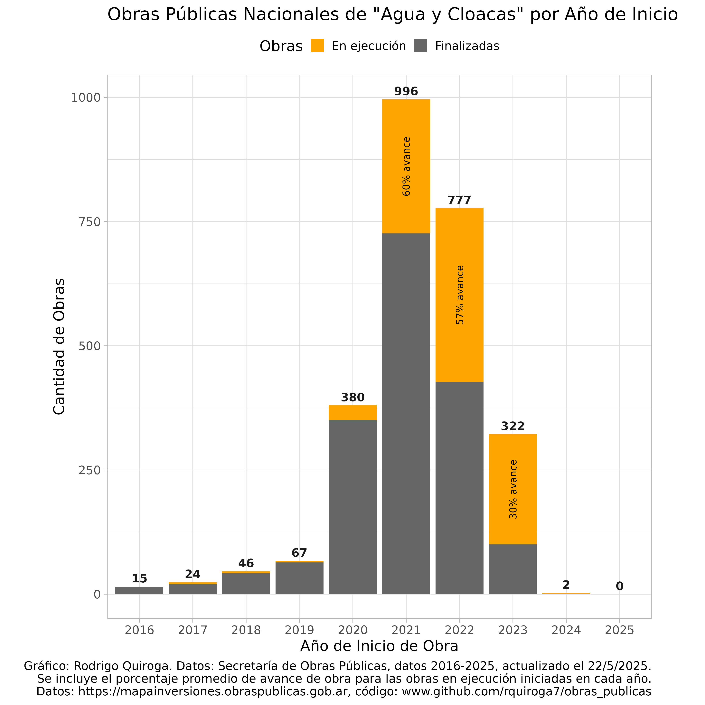

# Obras Públicas Nacionales - Agua y Cloacas

Este repositorio contiene un script en R (`plot_script.R`) que analiza y visualiza datos de obras públicas para el sector "Agua y Cloacas" de la Secretaría de Obras Públicas.

## Gráfico

Para más detalles, consulta el script y la fuente de datos: [https://mapainversiones.obraspublicas.gob.ar](https://mapainversiones.obraspublicas.gob.ar)
